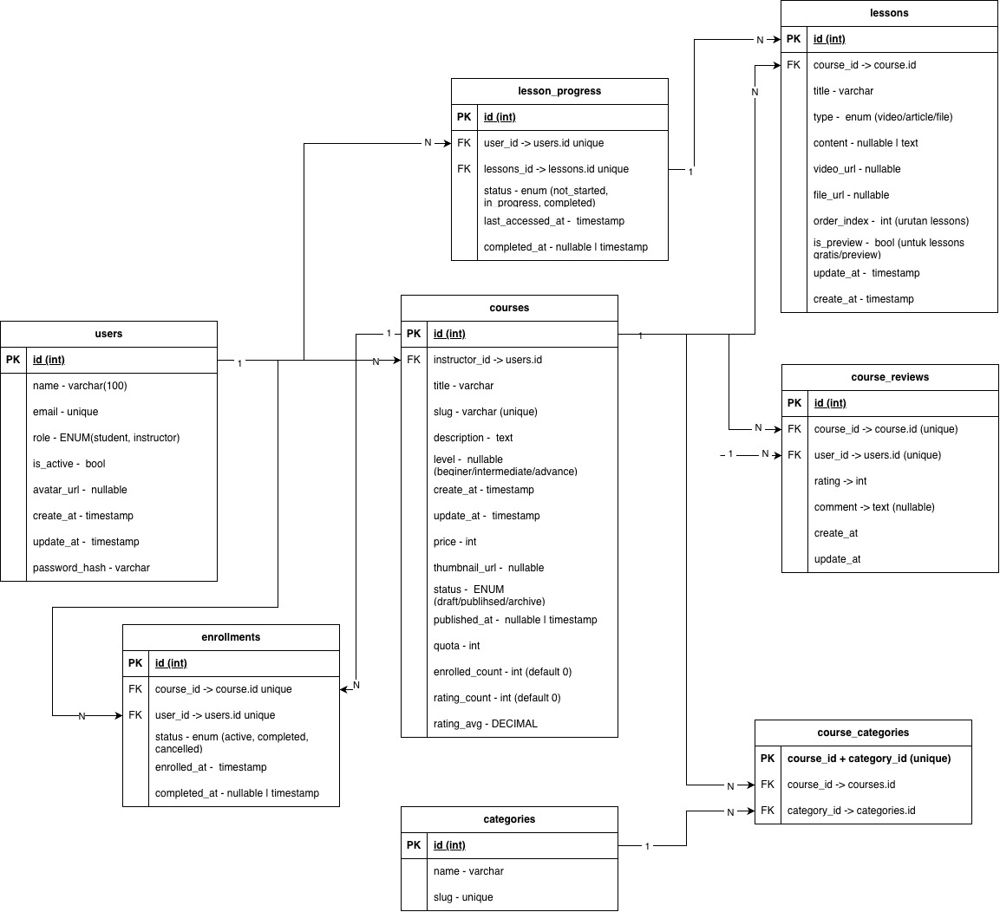

# Assignment Information

- Day 34: CRUD API Create Delete
- Branch: `assigment/day/34/crud-api-create-delete`

- Day 38: Laravel REST API - CRUD Product
- Branch: `assigment/day/34/crud-api-create-delete`

# LMS Dibimbing

A simple Learning Management System (LMS) built with Laravel for backend development assignment. This project provides basic CRUD operations for Users, Courses, and Categories, with lesson management within courses and soft delete functionality.

## Features

- **Authentication**: User registration, login, logout, and profile management
- **Course Management**: Create, read, update, delete courses with lesson management
- **Category Management**: Organize courses with categories
- **Lesson Management**: Add, update, delete lessons within courses
- **Soft Delete**: Soft delete for courses and lessons with restore and force delete options
- **API Authentication**: Using Laravel Sanctum for secure API access
- **Database Migrations**: Structured database schema with relationships

## Technologies Used

- **Laravel 11**: PHP framework for backend development
- **MySQL**: Database management system
- **Laravel Sanctum**: API authentication
- **Composer**: PHP dependency management
- **Postman**: API testing (collection provided)

## Installation

### Prerequisites

- PHP 8.1 or higher
- Composer
- MySQL
- Node.js & npm (for frontend assets)

### Steps

1. **Clone the repository**

    ```bash
    git clone https://github.com/your-username/lms-dibimbing.git
    cd lms-dibimbing
    ```

2. **Install PHP dependencies**

    ```bash
    composer install
    ```

3. **Install Node.js dependencies**

    ```bash
    npm install
    ```

4. **Environment Configuration**

    ```bash
    cp .env.example .env
    ```

    Update the `.env` file with your database credentials:

    ```env
    DB_CONNECTION=mysql
    DB_HOST=127.0.0.1
    DB_PORT=3306
    DB_DATABASE=lms_dibimbing
    DB_USERNAME=your_username
    DB_PASSWORD=your_password
    ```

5. **Generate Application Key**

    ```bash
    php artisan key:generate
    ```

6. **Run Database Migrations**

    ```bash
    php artisan migrate
    ```

7. **Seed Database (Optional)**

    ```bash
    php artisan db:seed
    ```

8. **Build Frontend Assets**

    ```bash
    npm run build
    ```

9. **Start the Development Server**
    ```bash
    php artisan serve
    ```

The application will be available at `http://localhost:8000`

## API Endpoints

### Authentication

- `POST /api/v1/auth/register` - User registration
- `POST /api/v1/auth/login` - User login
- `POST /api/v1/auth/logout` - User logout (requires auth)
- `GET /api/v1/auth/profile` - Get user profile (requires auth)
- `GET /api/v1/auth/user/{id}` - Get user by ID (requires auth)

### Courses

- `GET /api/v1/courses` - List all courses
- `GET /api/v1/courses/{id}` - Get course details with lessons
- `POST /api/v1/courses` - Create new course with lessons (requires auth)
- `PUT /api/v1/courses/{id}` - Update course and manage lessons (requires auth)
- `DELETE /api/v1/courses/{id}` - Soft delete course (requires auth)
- `POST /api/v1/courses/{id}/restore` - Restore soft deleted course (requires auth)
- `DELETE /api/v1/courses/{id}/force` - Force delete course (requires auth)

### Lessons (within Courses)

- `POST /api/v1/courses/{courseId}/lessons/{lessonId}/restore` - Restore soft deleted lesson (requires auth)
- `DELETE /api/v1/courses/{courseId}/lessons/{lessonId}/force` - Force delete lesson (requires auth)

### Categories

- `GET /api/v1/categories` - List all categories
- `GET /api/v1/categories/{id}` - Get category details with courses
- `POST /api/v1/categories` - Create new category (requires auth)
- `PUT /api/v1/categories/{id}` - Update category (requires auth)
- `DELETE /api/v1/categories/{id}` - Delete category (requires auth)

## Database Schema (ERD)



The ERD shows the relationships between Users, Courses, Lessons, and Categories.

## Testing

### Postman Collection

A Postman collection is provided for testing the API endpoints. You can find it in the `postman/` directory:

- `Eduka_LMS_Dibimbing.postman_collection.json`

To use it:

1. Import the collection into Postman
2. Set up environment variables for base URL and authentication tokens
3. Run the requests in order

### Running Tests

```bash
php artisan test
```

## Project Structure

```
lms-dibimbing/
├── app/
│   ├── Http/Controllers/Api/
│   │   ├── AuthController.php
│   │   ├── CourseController.php
│   │   └── CategoryController.php
│   └── Models/
│       ├── User.php
│       ├── Course.php
│       ├── Lesson.php
│       └── Category.php
├── database/migrations/
├── routes/api.php
├── assets/img/erd.jpg
└── postman/
    └── LMS_Dibimbing.postman_collection.json
```

## Contributing

1. Fork the repository
2. Create a feature branch (`git checkout -b feature/new-feature`)
3. Commit your changes (`git commit -am 'Add new feature'`)
4. Push to the branch (`git push origin feature/new-feature`)
5. Create a Pull Request

## License

This project is licensed under the MIT License - see the [LICENSE](LICENSE) file for details.

## Author

Handika Djati Dharma - Backend Development Assignment for Dibimbing

## Security Vulnerabilities

If you discover a security vulnerability within Laravel, please send an e-mail to Taylor Otwell via [taylor@laravel.com](mailto:taylor@laravel.com). All security vulnerabilities will be promptly addressed.

## License

The Laravel framework is open-sourced software licensed under the [MIT license](https://opensource.org/licenses/MIT).

# eduka
